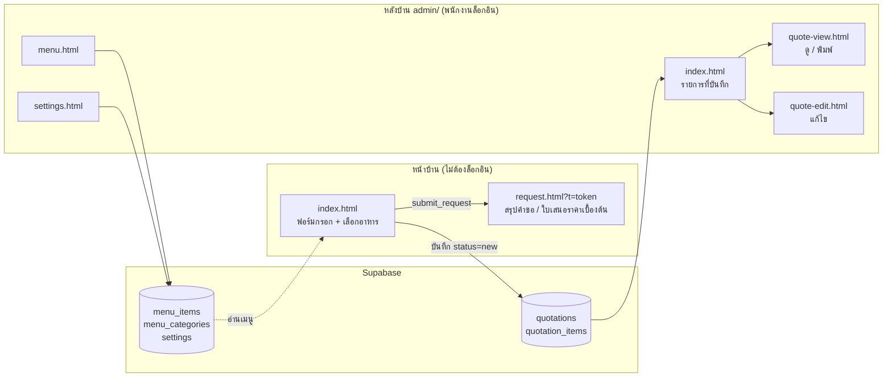
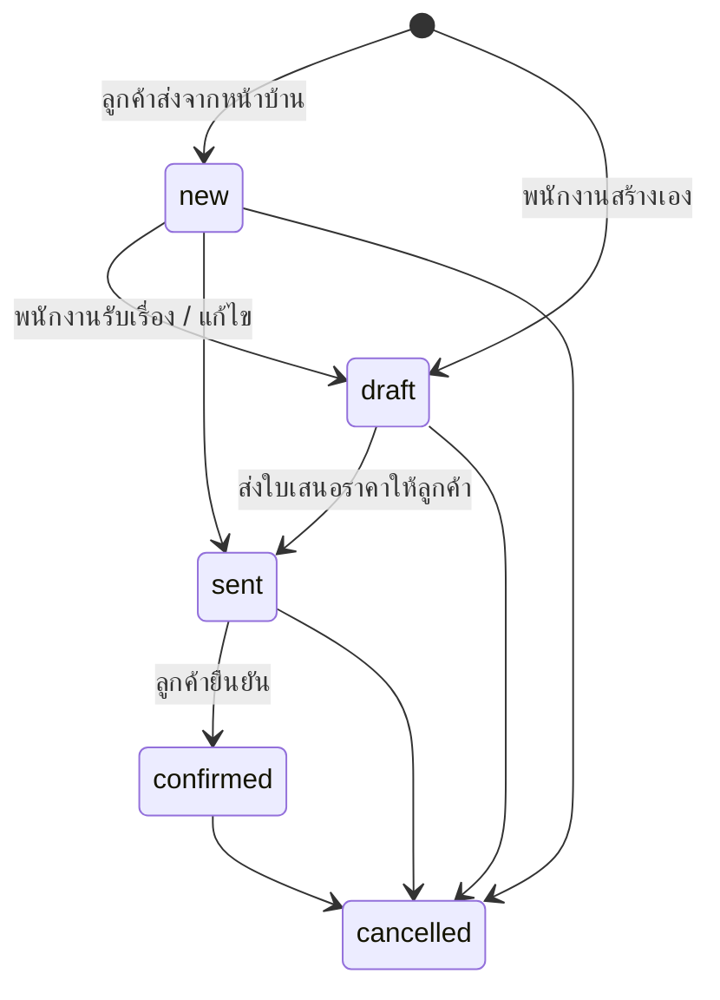
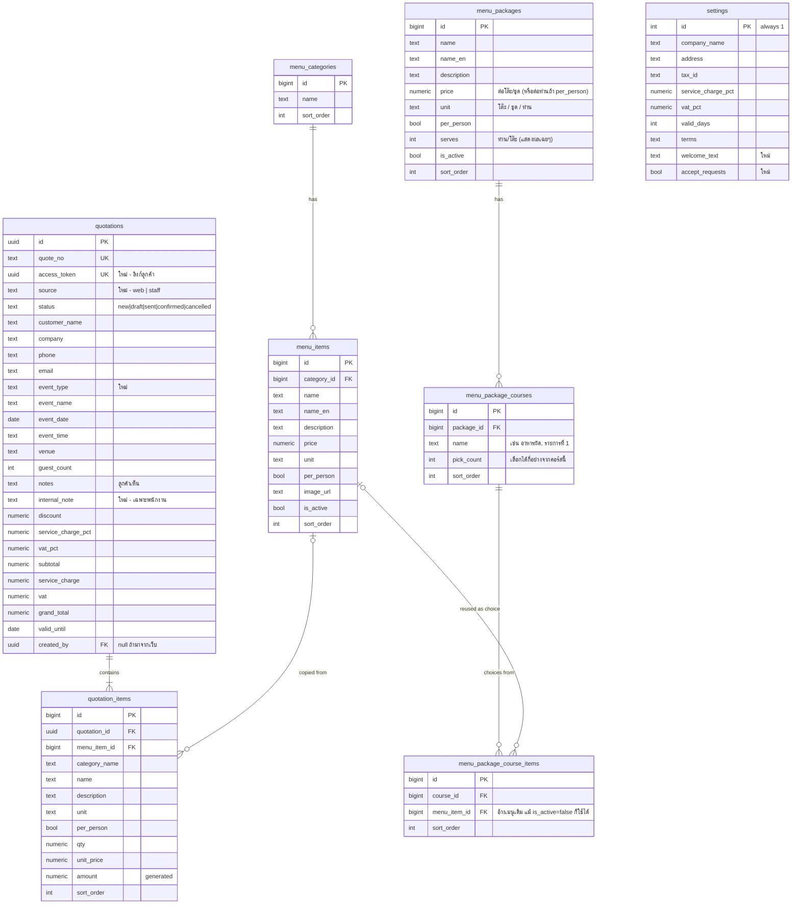

# ระบบเลือกเมนูงานจัดเลี้ยง & ออกใบเสนอราคา (Banquet Quotation)

> เอกสารออกแบบระบบ — **v0.2 (2026-09-14)**
> Tech stack: **HTML + CSS + Vanilla JS** (ไม่มี build step) + **Supabase** (Postgres, Auth, RLS)

### สิ่งที่เปลี่ยนจาก v0.1
- แบ่งระบบเป็น **2 ส่วนใหญ่**: **หน้าบ้าน** (ลูกค้ากรอกฟอร์ม + เลือกอาหารเอง ไม่ต้องล็อกอิน) และ **หลังบ้าน** (พนักงานดูรายการที่บันทึก)
- ย้ายหน้าจอของพนักงานทั้งหมดไปไว้ในโฟลเดอร์ `admin/`
- เพิ่มสถานะ `new` (คำขอใหม่จากลูกค้า), คอลัมน์ `source`, `event_type`, `access_token`
- เพิ่ม RPC สำหรับลูกค้า: `submit_request`, `get_request_by_token` — **ราคาคำนวณจากฐานข้อมูลเสมอ** ลูกค้าแก้ราคาเองไม่ได้

---

## 1. เป้าหมาย

**หน้าบ้าน (ลูกค้า)**
1. ลูกค้าเข้าเว็บ กรอกข้อมูลงาน เลือกเมนูอาหารเองได้ทันที
2. เห็นราคาประเมินเบื้องต้นแบบ real-time
3. กดส่ง → ได้เลขที่คำขอ + หน้าสรุปใบเสนอราคาเบื้องต้นที่พิมพ์/บันทึก PDF ได้

**หลังบ้าน (พนักงาน)**
1. ดูรายการคำขอ/ใบเสนอราคาที่บันทึกทั้งหมด เห็นคำขอใหม่ชัดเจน
2. เปิดดูรายละเอียด แก้ไขรายการ/ราคา/ส่วนลด เปลี่ยนสถานะ
3. พิมพ์ใบเสนอราคาฉบับทางการ
4. จัดการเมนูอาหารและตั้งค่าโรงแรม

### ขอบเขตที่ไม่ทำในเฟสแรก
- ใบแจ้งหนี้ / ใบเสร็จ / รับชำระเงินออนไลน์
- ส่งอีเมล / LINE แจ้งเตือนอัตโนมัติ
- ระบบจองห้องจัดเลี้ยง (ตารางห้องว่าง)

---

## 2. ภาพรวมระบบ



---

## 3. ผู้ใช้งานและสิทธิ์

| บทบาท | ทำอะไรได้ |
|---|---|
| **ลูกค้า** (ไม่ล็อกอิน / `anon`) | อ่านเมนูที่เปิดใช้งาน, อ่านข้อมูลโรงแรม, **ส่งคำขอ** ผ่าน RPC, ดูคำขอของตัวเองผ่านลิงก์ที่มี token |
| **พนักงาน** (ล็อกอิน / `authenticated`) | ทุกอย่างในหลังบ้าน: ดู/แก้/ลบ ใบเสนอราคา, จัดการเมนู, ตั้งค่า |

- ลูกค้า **อ่านตาราง `quotations` ตรงๆ ไม่ได้** — ดูได้เฉพาะใบของตัวเองผ่าน token
- บัญชีพนักงานสร้างผ่าน Supabase Dashboard เท่านั้น (ปิด public sign-up)

---

## 4. หน้าบ้าน (ลูกค้า)

ออกแบบ **mobile-first** เพราะลูกค้าส่วนใหญ่เปิดจากมือถือ

### 4.1 `index.html` — ฟอร์มขอใบเสนอราคา

แบ่งเป็น 3 ขั้นตอน มีแถบความคืบหน้าด้านบน

```
 ①ข้อมูลงาน ─── ②เลือกอาหาร ─── ③ข้อมูลติดต่อ & ยืนยัน
```

**ขั้นที่ 1 — ข้อมูลงาน**
| ช่อง | บังคับ | หมายเหตุ |
|---|---|---|
| ประเภทงาน | ✔ | สัมมนา / งานเลี้ยงบริษัท / งานแต่งงาน / วันเกิด / อื่นๆ |
| ชื่องาน | | |
| วันที่จัดงาน | ✔ | ต้องไม่ใช่วันที่ผ่านมาแล้ว |
| ช่วงเวลา | | เช้า / กลางวัน / เย็น หรือพิมพ์เอง |
| จำนวนแขก (ท่าน) | ✔ | 1 – 5,000 |

**ขั้นที่ 2 — เลือกอาหาร**
- ชิปหมวดหมู่ + ช่องค้นหา
- การ์ดเมนู: รูป (ถ้ามี), ชื่อไทย/อังกฤษ, คำอธิบาย, ราคา/หน่วย, ปุ่ม **เลือก**
- เมนูคิดต่อท่าน → จำนวน = จำนวนแขก (ลูกค้าแก้ไม่ได้)
- เมนูคิดต่อหน่วย (ตัว, ชุด, งาน) → ลูกค้าเลือกจำนวนได้ (ปุ่ม − / +)
- **แถบสรุปติดล่างจอ**: จำนวนรายการที่เลือก · ราคาประเมิน · ปุ่ม "ถัดไป"
- ต้องเลือกอย่างน้อย 1 รายการ

**ขั้นที่ 3 — ข้อมูลติดต่อ & ยืนยัน**
| ช่อง | บังคับ |
|---|---|
| ชื่อผู้ติดต่อ | ✔ |
| เบอร์โทร | ✔ |
| อีเมล | |
| บริษัท / หน่วยงาน | |
| หมายเหตุ (แพ้อาหาร, มังสวิรัติ ฯลฯ) | |

- แสดงสรุปรายการที่เลือก + ราคาประเมิน (รวม, ค่าบริการ, VAT, สุทธิ)
- ข้อความ: *"ราคานี้เป็นราคาประเมินเบื้องต้น เจ้าหน้าที่จะติดต่อกลับเพื่อยืนยัน"*
- checkbox ยินยอมให้เก็บข้อมูลติดต่อ (PDPA)
- ปุ่ม **ส่งคำขอใบเสนอราคา**

**พฤติกรรมอื่นๆ**
- เก็บข้อมูลที่กรอกไว้ใน `localStorage` — ปิดหน้าแล้วกลับมาไม่หาย, ล้างเมื่อส่งสำเร็จ
- ย้อนกลับไปแก้ขั้นก่อนหน้าได้โดยข้อมูลไม่หาย
- กันส่งซ้ำ (ปิดปุ่มระหว่างส่ง)

### 4.2 `request.html?t=<token>` — สรุปคำขอ / ใบเสนอราคาเบื้องต้น
- แสดงหลังส่งสำเร็จ: **"ได้รับคำขอแล้ว เลขที่ QT2609-0001"**
- เนื้อหาเหมือนใบเสนอราคา A4 แต่หัวเอกสารเขียน **"ใบเสนอราคาเบื้องต้น"** + สถานะปัจจุบัน
- ปุ่ม: พิมพ์ / บันทึก PDF · คัดลอกลิงก์ · กลับไปหน้าแรก
- ลิงก์นี้เปิดดูซ้ำได้ (ถ้าพนักงานแก้ไขแล้ว ลูกค้าจะเห็นฉบับล่าสุด)
- token ผิด → "ไม่พบคำขอ"

---

## 5. หลังบ้าน (พนักงาน) — โฟลเดอร์ `admin/`

ทุกหน้าต้องล็อกอิน, มีแถบเมนูด้านบน: **รายการที่บันทึก · สร้างใบใหม่ · เมนูอาหาร · ตั้งค่า · ออกจากระบบ**

### 5.1 `admin/login.html`
อีเมล + รหัสผ่าน, รองรับ `?next=` กลับไปหน้าเดิม

### 5.2 `admin/index.html` — รายการที่บันทึก (หน้าหลักหลังบ้าน)
- การ์ดสรุป: **คำขอใหม่** (เน้นสี) · ฉบับร่าง · ส่งลูกค้าแล้ว · ยืนยันแล้ว (+ มูลค่า)
- ตาราง: เลขที่, ที่มา (🌐 เว็บ / 👤 พนักงาน), ลูกค้า + เบอร์, ประเภท/ชื่องาน, วันงาน, แขก, ยอดสุทธิ, สถานะ, วันที่ส่ง
- แถวที่เป็น `new` แสดงตัวหนา/พื้นเน้น
- ค้นหา (เลขที่, ชื่อ, บริษัท, เบอร์, ชื่องาน) · กรองสถานะ · กรองที่มา · กรองช่วงวันงาน
- เรียงตาม: วันที่ส่งล่าสุด (ค่าเริ่มต้น) / วันงานใกล้สุด
- ปุ่มต่อแถว: **ดู** · **แก้ไข** · **ทำสำเนา** · **ลบ**
- แบ่งหน้า (server-side) ครั้งละ 50 รายการ

### 5.3 `admin/quote-view.html?id=` — ดูรายละเอียด / พิมพ์
- ใบเสนอราคา A4 ฉบับทางการ (รายละเอียดใน 5.6)
- แถบเครื่องมือ: กลับ · แก้ไข · เปลี่ยนสถานะ · **โทร** (tel:) · **คัดลอกลิงก์ลูกค้า** · พิมพ์
- แสดงหมายเหตุภายใน (`internal_note`) ที่ลูกค้าไม่เห็น — *ไม่พิมพ์ออกมา*

### 5.4 `admin/quote-edit.html` — สร้าง / แก้ไข
(เหมือน v0.1)
- ฝั่งซ้ายเลือกเมนู, ฝั่งขวาข้อมูลลูกค้า/งาน + ตารางรายการ + สรุปยอด
- พนักงาน **แก้ราคา/จำนวนได้อิสระ**, เพิ่ม "รายการอื่นๆ" ได้, ใส่ส่วนลดได้
- เมนูต่อท่านผูกกับจำนวนแขก (แก้จำนวนเอง = เลิกผูก, กด "ใช้จำนวนแขก" เพื่อผูกใหม่)
- ราคาเป็นสำเนา ณ เวลาบันทึก — แก้ราคาเมนูทีหลังไม่กระทบใบเก่า
- เตือนก่อนออกจากหน้าถ้ายังไม่บันทึก

### 5.5 `admin/menu.html` — จัดการเมนู
หมวดหมู่ (เพิ่ม/แก้ชื่อ/ลำดับ/ลบ) + เมนู (ตาราง, ค้นหา, กรอง, dialog เพิ่ม/แก้, เปิด/ปิดใช้งาน)

### 5.6 `admin/settings.html` — ตั้งค่า
ชื่อโรงแรม ไทย/อังกฤษ, ที่อยู่, เลขผู้เสียภาษี, โทร, อีเมล, URL โลโก้,
ค่าบริการ %, VAT %, จำนวนวันที่ใบเสนอราคามีผล, เงื่อนไข, **ข้อความต้อนรับหน้าบ้าน**, **เปิด/ปิดรับคำขอจากหน้าบ้าน**

### รูปแบบใบเสนอราคา A4 (ใช้ร่วมกันทั้ง 4.2 และ 5.3)
```
┌──────────────────────────────────────────────────────┐
│ [โลโก้] ชื่อโรงแรม                     ใบเสนอราคา       │
│ ที่อยู่ / เลขผู้เสียภาษี / โทร             QUOTATION        │
│                                  เลขที่  QT2609-0001   │
│                                  วันที่  14 ก.ย. 2569   │
├──────────────────────────┬───────────────────────────┤
│ ลูกค้า                     │ รายละเอียดงาน              │
├────┬─────────────────────┬──────┬──────┬───────┬───────┤
│ #  │ รายการ (จัดกลุ่มตามหมวด) │ จำนวน │ หน่วย │ ราคา   │ จำนวนเงิน│
├────┴─────────────────────┴──────┴──────┴───────┴───────┤
│ (ตัวอักษรภาษาไทย...บาทถ้วน)          รวม / ส่วนลด / SC / VAT │
│                                   ยอดรวมสุทธิ          │
├──────────────────────────────────────────────────────┤
│ หมายเหตุ / เงื่อนไข                                      │
├──────────────────────────┬───────────────────────────┤
│ ผู้เสนอราคา                 │ ผู้อนุมัติ (ลูกค้า)             │
└──────────────────────────┴───────────────────────────┘
```

---

## 6. สถานะและ Flow



| ค่า | แสดงผลหลังบ้าน | แสดงผลลูกค้า |
|---|---|---|
| `new` | 🔔 คำขอใหม่ | รอเจ้าหน้าที่ตรวจสอบ |
| `draft` | ฉบับร่าง | กำลังจัดทำใบเสนอราคา |
| `sent` | ส่งลูกค้าแล้ว | ใบเสนอราคาพร้อมแล้ว |
| `confirmed` | ยืนยันแล้ว | ยืนยันการจองแล้ว |
| `cancelled` | ยกเลิก | ยกเลิก |

---

## 7. ฐานข้อมูล



**เลขที่เอกสาร**: `QT<YYMM>-<running 4 หลัก>` เช่น `QT2609-0001` — trigger + ตาราง `quote_counters`, รีเซ็ตทุกเดือน (Asia/Bangkok)

---

## 8. การคำนวณราคา

```
subtotal        = Σ round(qty × unit_price, 2)
base            = max(subtotal − discount, 0)
service_charge  = round(base × service_charge_pct / 100, 2)
vat             = round((base + service_charge) × vat_pct / 100, 2)
grand_total     = base + service_charge + vat
```

| | หน้าบ้าน (ลูกค้า) | หลังบ้าน (พนักงาน) |
|---|---|---|
| ราคา/หน่วย | ดึงจาก `menu_items` ในฐานข้อมูลเท่านั้น | แก้ไขได้ |
| จำนวน (ต่อท่าน) | = จำนวนแขก บังคับ | แก้ไขได้ |
| จำนวน (ต่อหน่วย) | 1 – 100 | แก้ไขได้ |
| ส่วนลด | 0 | ใส่ได้ |
| SC / VAT % | จาก `settings` | แก้ได้รายใบ |
| รายการอื่นๆ | ไม่ได้ | ได้ |

หน้าเว็บคำนวณเพื่อแสดงผล, **ยอดที่บันทึกคำนวณซ้ำในฐานข้อมูลทุกครั้ง**

---

## 9. API / RPC

### หน้าบ้าน (`anon`)
| งาน | วิธี |
|---|---|
| โหลดเมนู | `from('menu_items').select(...)` — RLS ให้เห็นเฉพาะ `is_active = true` |
| โหลดหมวดหมู่ | `from('menu_categories').select(...)` |
| โหลดข้อมูลโรงแรม | `rpc('get_public_settings')` — คืนเฉพาะข้อมูลที่เปิดเผยได้ |
| โหลดแพ็กเกจ | `rpc('get_public_packages')` — แพ็กเกจ+คอร์ส+ตัวเลือกซ้อนกันเป็น jsonb เดียว (เฉพาะแพ็กเกจ `is_active`) |
| **ส่งคำขอ** | `rpc('submit_request', { p_request, p_items })` → `{ quote_no, access_token }` |
| **ดูคำขอของตัวเอง** | `rpc('get_request_by_token', { p_token })` → ใบเสนอราคา + รายการ (ไม่มี `internal_note`) |

**`submit_request(p_request jsonb, p_items jsonb)`** — `security definer`
- ตรวจ `settings.accept_requests = true`
- ตรวจช่องบังคับ: ชื่อ, เบอร์โทร, ประเภทงาน, วันที่ (≥ วันนี้), จำนวนแขก 1–5,000
- `p_items` เป็นอาร์เรย์ผสมได้ สูงสุด 100 รายการ (แพ็กเกจนับเป็น 1 แม้จะมีหลายคอร์ส) — **ไม่รับชื่อ/ราคาจากลูกค้า**:
  - เมนูเดี่ยว `{ menu_item_id, qty }` — ดึงชื่อ/หน่วย/ราคาจาก `menu_items` (ต้อง `is_active`), ต่อท่านบังคับ qty = จำนวนแขก, ต่อหน่วยจำกัด 1–100
  - แพ็กเกจ `{ menu_package_id, qty, choices:[{course_id, menu_item_id}] }` — ตรวจทุกคอร์สของแพ็กเกจว่าเลือกครบตาม `pick_count`
    และตัวเลือกที่ส่งมาอยู่ใน `menu_package_course_items` ของคอร์สนั้นจริง (กันสวมสิทธิ์ยืมจานจากแพ็กเกจ/คอร์สอื่น) ก่อนคำนวณราคาจาก `menu_packages.price`
- บันทึก `status = 'new'`, `source = 'web'`, SC/VAT จาก settings, คำนวณยอด
- ช่อง honeypot ต้องว่าง (กันบอท)

### หลังบ้าน (`authenticated`)
| งาน | วิธี |
|---|---|
| ล็อกอิน / ออก | `auth.signInWithPassword`, `auth.signOut` |
| รายการที่บันทึก | `from('quotations').select(..., { count: 'exact' }).range(from, to)` + filter |
| การ์ดสรุป | `rpc('quotation_stats')` → จำนวน/มูลค่า ตามสถานะ |
| โหลดใบ + รายการ | `from('quotations').select('*, quotation_items(*)').eq('id', id).single()` |
| บันทึก | `rpc('save_quotation', { p_quote, p_items })` → `uuid` |
| เปลี่ยนสถานะ | `from('quotations').update({ status }).eq('id', id)` |
| ทำสำเนา | โหลดใบเดิม → `save_quotation` ไม่ส่ง `id`, status = `draft` |

---

## 10. ความปลอดภัย

| ตาราง / ฟังก์ชัน | `anon` (ลูกค้า) | `authenticated` (พนักงาน) |
|---|---|---|
| `menu_categories` | select | all |
| `menu_items` | select เฉพาะ `is_active` | all |
| `menu_packages` / `menu_package_courses` / `menu_package_course_items` | ✗ (อ่านผ่าน `get_public_packages()`) | all |
| `settings` | ✗ (อ่านผ่าน `get_public_settings()`) | select, update |
| `quotations`, `quotation_items` | ✗ | all |
| `submit_request()` | execute | execute |
| `get_request_by_token()` | execute | execute |
| `get_public_settings()`, `get_public_packages()` | execute | execute |
| `save_quotation()`, `quotation_stats()` | ✗ | execute |

- `access_token` เป็น UUID สุ่ม (เดาไม่ได้) — ใครมีลิงก์ดูใบนั้นได้ ไม่ต้องล็อกอิน
- ห้ามใส่ `service_role` key ในหน้าเว็บ, ปิด public sign-up
- Escape HTML ทุกข้อความก่อน render (ข้อมูลจากลูกค้าถือว่าไม่น่าเชื่อถือ)
- กันสแปม เฟส 1: honeypot + ตรวจข้อมูลใน RPC · เฟส 2: Cloudflare Turnstile ผ่าน Edge Function

---

## 11. โครงสร้างไฟล์

```
shotel_banquet/
├── SPEC.md / README.md
├── config.js                  SUPABASE_URL, SUPABASE_ANON_KEY
│
├── index.html                 【หน้าบ้าน】 ฟอร์มกรอก + เลือกอาหาร (3 ขั้นตอน)
├── request.html               【หน้าบ้าน】 สรุปคำขอ / ใบเสนอราคาเบื้องต้น
│
├── admin/                     【หลังบ้าน】
│   ├── login.html
│   ├── index.html             รายการที่บันทึก
│   ├── quote-view.html
│   ├── quote-edit.html         รวมปุ่ม "+ แพ็กเกจ" (โหลด front.css มาใช้ .choices/.pkg-course ร่วม)
│   ├── menu.html
│   ├── packages.html           จัดการแพ็กเกจ/คอร์ส/ตัวเลือกในคอร์ส
│   └── settings.html
│
├── assets/
│   ├── img/logo.png            โลโก้ (ใช้เป็น favicon + หัวเว็บ + หัวใบเสนอราคา)
│   ├── css/
│   │   ├── app.css            สไตล์พื้นฐานร่วม + ธีมสว่าง/มืด + ใบเสนอราคา A4 + print
│   │   └── front.css          สไตล์หน้าบ้าน (wizard, แถบสรุปล่างจอ, การ์ดแพ็กเกจ) — quote-edit.html โหลดด้วย
│   └── js/
│       ├── core.js            supabase client, esc, format เงิน/วันที่ไทย, bahtText, calcTotals, toast
│       ├── quote-render.js    render ใบเสนอราคา A4 (ใช้ทั้งหน้าบ้าน/หลังบ้าน)
│       └── admin.js           auth guard, header หลังบ้าน
│
└── supabase/
    ├── schema.sql
    └── seed.sql
```

---

## 12. ขั้นตอนติดตั้ง (สรุป)

1. สร้างโปรเจกต์ [supabase.com](https://supabase.com)
2. SQL Editor → รัน `supabase/schema.sql` → (ถ้าต้องการ) `supabase/seed.sql`
3. Authentication → **ปิด Allow new users to sign up** → Add user พนักงาน
4. คัดลอก `Project URL` + `anon key` ใส่ `config.js`
5. หน้าบ้าน: `http://localhost/shotel_banquet/` · หลังบ้าน: `http://localhost/shotel_banquet/admin/`

---

## 13. คำถามที่ต้องตัดสินใจ

| # | คำถาม | ค่าเริ่มต้นที่เสนอ |
|---|---|---|
| 1 | ~~ใครเลือกเมนู~~ | ✅ **ลูกค้าเลือกเองที่หน้าบ้าน + พนักงานสร้าง/แก้ได้ที่หลังบ้าน** |
| 2 | ลูกค้าเห็นราคาในหน้าบ้านไหม? | เห็นราคาประเมิน |
| 3 | ~~โมเดลราคา — ต่อเมนู หรือแพ็กเกจ?~~ | ✅ **ทั้งสองแบบ** — เมนูเดี่ยว (Coffee Break) + แพ็กเกจ (โต๊ะจีน/Thai-set เลือกได้ X อย่างจากแต่ละคอร์ส) |
| 4 | กำหนดจำนวนแขกขั้นต่ำไหม? (เช่น ≥ 30 ท่าน) | ไม่กำหนด |
| 5 | ต้องจองล่วงหน้ากี่วัน? | ไม่กำหนด (แค่ห้ามวันที่ผ่านมาแล้ว) |
| 6 | ประเภทงานมีอะไรบ้าง? | สัมมนา, งานเลี้ยงบริษัท, งานแต่งงาน, วันเกิด, อื่นๆ |
| 7 | ลูกค้าเลือกห้อง/สถานที่เองไหม? | ไม่ — พนักงานกรอกที่หลังบ้าน |
| 8 | ลูกค้ากด "ยืนยัน" ใบเสนอราคาออนไลน์ได้ไหม? | ยังไม่ได้ (เฟส 2) |
| 9 | แจ้งเตือนพนักงานเมื่อมีคำขอใหม่? | เฟส 1: ดูในหลังบ้าน · เฟส 2: อีเมล/LINE |
| 10 | ราคา `++` หรือ net? | `++` ปรับ % ได้ |
| 11 | แยกสิทธิ์ admin / sales? | ยังไม่แยก |
| 12 | PDF — Print ของเบราว์เซอร์พอไหม? | พอ |

---

## 14. แผนการพัฒนา

### เฟส 1A — หลังบ้าน (v0.1) ✅ เขียนแล้ว
- [x] schema, seed, RPC `save_quotation`, RLS
- [x] login, รายการใบเสนอราคา, สร้าง/แก้ไข, ดู/พิมพ์ A4, จัดการเมนู, ตั้งค่า
- [x] README

### เฟส 1B — ปรับโครงสร้างเป็นหน้าบ้าน/หลังบ้าน (v0.2)
**ฐานข้อมูล**
- [x] เพิ่มคอลัมน์ `access_token`, `source`, `event_type`, `internal_note` + สถานะ `new`
- [x] เพิ่ม `settings.welcome_text`, `settings.accept_requests` + RPC `get_public_settings`
- [x] RPC `submit_request`, `get_request_by_token`, `quotation_stats`
- [x] RLS สำหรับ `anon` (อ่านเมนู/หมวดหมู่)
- [x] ติดตั้งลงฐานข้อมูลจริงแล้ว (2026-09-14) + เมนูตัวอย่าง 40 รายการ

**หลังบ้าน**
- [x] ย้ายหน้าเดิมไป `admin/` + แยก `common.js` → `core.js` / `admin.js` / `quote-render.js`
- [x] รายการที่บันทึก: การ์ด "คำขอใหม่", คอลัมน์ที่มา/เบอร์, กรองที่มา/ช่วงวันงาน, แบ่งหน้า server-side
- [x] quote-view: คัดลอกลิงก์ลูกค้า, ปุ่มโทร, หมายเหตุภายใน
- [x] quote-edit: ช่องประเภทงาน + หมายเหตุภายใน
- [x] settings: ข้อความต้อนรับ, เปิด/ปิดรับคำขอ

**หน้าบ้าน**
- [x] `index.html` ฟอร์ม 3 ขั้นตอน + แถบสรุปล่างจอ + บันทึกร่างใน localStorage
- [x] `request.html` สรุปคำขอ / ใบเสนอราคาเบื้องต้น
- [x] `front.css` mobile-first

**ทดสอบ**
- [x] ทดสอบฐานข้อมูลจริง 32 กรณี: สิทธิ์ `anon`, ราคามาจากฐานข้อมูล, ตรวจข้อมูลผิด, กันส่งถี่, พนักงานแก้ไข → ลูกค้าเห็นฉบับล่าสุด
- [x] ทดสอบผ่านหน้าเว็บจริง (browser automation ครบ: ส่งคำขอ, ล็อกอินหลังบ้าน, แก้ไข, พิมพ์)
- [x] ใส่รหัส anon key จริง, ปิด public sign-up, สร้างบัญชีพนักงาน, ตั้งชื่อโรงแรม "Shotel"
- [x] นำเข้าเมนูจริงจากลูกค้า (145 จาน + 6 แพ็กเกจเบรก, ดูหัวข้อ 15)
- [x] ธีมสว่าง/มืด (ดำ-ทอง ตามโลโก้) + ปรับ mobile responsive ทุกหน้า + ใส่โลโก้จริง

### เฟส 1C — แพ็กเกจอาหาร / Set Menu (v0.3) ✅ เขียนแล้ว
ธุรกิจจริงขายเป็น "ชุด" (Thai-set 3 ระดับราคา, โต๊ะจีน 2 ระดับราคา) ที่มีหลายคอร์ส
แต่ละคอร์สให้เลือก 1 (หรือมากกว่า) จากรายชื่อที่กำหนดไว้ — ไม่ใช่ราคาต่อจานแบบเดิม

**ฐานข้อมูล**
- [x] ตาราง `menu_packages` / `menu_package_courses` / `menu_package_course_items` (อ้างอิง `menu_items` เดิมเป็นตัวเลือก)
- [x] RPC `get_public_packages()` — คืนแพ็กเกจ+คอร์ส+ตัวเลือกแบบซ้อน (security definer, ไม่ต้องเปิด RLS ตรงให้ anon)
- [x] `submit_request` รองรับ `p_items` แบบผสม: เมนูเดี่ยว `{menu_item_id, qty}` และแพ็กเกจ `{menu_package_id, qty, choices:[{course_id, menu_item_id}]}`
      ตรวจฝั่งเซิร์ฟเวอร์ทุกคอร์สว่าเลือกครบตาม `pick_count` และตัวเลือกอยู่ในคอร์สนั้นจริง (กันสวมสิทธิ์ข้ามแพ็กเกจ)
- [x] `save_quotation` (หลังบ้าน) ไม่ต้องแก้ — พนักงานคำนวณ line ฝั่ง client แล้วส่งเป็นรายการปกติ (เหมือนรายการอื่นๆ)
- [x] นำเข้าแพ็กเกจจริง 5 ชุดจากไฟล์ลูกค้า (ดูหัวข้อ 15)
- [x] ทดสอบ 7 กรณี (rollback transaction): เลือกครบ→ผ่าน, เลือกไม่ครบ→ปฏิเสธ, สวมสิทธิ์ข้ามแพ็กเกจ→ปฏิเสธ, แพ็กเกจปลอม/ปิดขาย→ปฏิเสธ, ผสมเมนู+แพ็กเกจ→ยอดถูกต้อง

**หน้าบ้าน**
- [x] `index.html`: การ์ดแพ็กเกจ → เลือกทีละคอร์ส (radio ถ้าเลือก 1, checkbox ถ้าเลือกได้มากกว่า 1 พร้อมบล็อกเกินโควตา) → แสดงสถานะ "ครบแล้ว/ยังไม่ครบ" → คิดราคาเมื่อครบเท่านั้น
- [x] บันทึกร่างแพ็กเกจใน localStorage ด้วย (คืนสภาพครบเหมือนตอนกด)
- [x] สรุป step 3 และใบเสนอราคาแสดงรายชื่อที่เลือกแยกตามคอร์ส

**หลังบ้าน**
- [x] `admin/packages.html` — จัดการแพ็กเกจ: เพิ่ม/แก้/ลบแพ็กเกจ, เพิ่ม/ลบคอร์ส, ตั้ง `pick_count`, เลือกเมนูเข้าคอร์ส (ค้นหา+ติ๊ก จากคลังเมนูทั้งหมดไม่ว่าจะเปิด/ปิดขายแยกก็ตาม)
- [x] `admin/quote-edit.html` — ปุ่ม "+ แพ็กเกจ" เปิดไดอะล็อกเลือกคอร์สแบบเดียวกับหน้าบ้าน แล้วแปลงเป็นบรรทัดในใบเสนอราคา (แก้ไข/ลบ/ปรับราคาได้อิสระเหมือนรายการอื่นๆ)
- [x] เพิ่มลิงก์ "แพ็กเกจ" ในเมนูหลังบ้าน

### เฟส 2 — ต่อยอด
- ลูกค้ากดยืนยันใบเสนอราคาออนไลน์
- แจ้งเตือนคำขอใหม่ทางอีเมล / LINE (Edge Function)
- Cloudflare Turnstile กันสแปม
- อัปโหลดรูปเมนู/โลโก้ผ่าน Supabase Storage
- แยกสิทธิ์ admin / sales, รายงานยอดขาย, export Excel, ประวัติการแก้ไข

---

## 15. ข้อมูลเมนูจริงที่นำเข้าแล้ว (2026-09-14)

ลูกค้าส่งไฟล์ Excel 2 ไฟล์มาให้ (`รายการเมนูอาหาร.xlsx`, `รายการเบรก.xlsx`) — นำเข้าด้วยสคริปต์
`scratchpad/import-menu.js` และ `scratchpad/import-packages.js` (ไม่อยู่ในโปรเจกต์ ใช้ครั้งเดียวตอนนำเข้า)

**อาหารว่าง (Coffee Break)** — เปิดขายจริง มีราคา
| รายการ | ราคา/ท่าน |
|---|---|
| Coffee Break เบเกอรี่ | 150 / 100 / 50 บาท |
| Coffee Break ขนมไทย | 150 / 100 / 50 บาท |

**เมนูอาหาร 145 จาน** — นำเข้าเป็นคลังเมนู **ปิดใช้งานไว้ก่อน ราคา 0** (ไฟล์ต้นฉบับมีแต่ราคาทุน ไม่มีราคาขาย)
แยก 9 หมวด: อาหารผัด(25) ทอด(1) ยำ(10) แกง/ต้ม(21) ปลา(15) ข้าว(2) ของหวาน(6) น้ำพริก+ผักสด(6) โต๊ะจีน-อาหารจีน(59)
รอพนักงานตั้งราคาขายจริงทีละจาน (หรือเปิดขายเป็นจานเดี่ยว) ที่ `admin/menu.html`

**แพ็กเกจ 5 ชุด** — เปิดขายจริง มีราคา ใช้เมนู 145 จานข้างต้นเป็นตัวเลือกในแต่ละคอร์ส
| แพ็กเกจ | ราคา/โต๊ะ | คอร์ส |
|---|---|---|
| Thai Set 3,000 | 3,000 | 5 คอร์ส (ตัวเลือกจำกัด) |
| Thai Set 3,500 | 3,500 | 6 คอร์ส |
| Thai Set 4,000 | 4,000 | 6 คอร์ส |
| โต๊ะจีน 4,200 | 4,200 | 6 คอร์ส (รายการที่ 1-6) |
| โต๊ะจีน 4,500 | 4,500 | 6 คอร์ส (รายการที่ 1-6) |

ทุกคอร์สตั้งเลือก 1 อย่าง (`pick_count = 1`) ตามข้อมูลต้นฉบับ — แก้เป็นเลือกได้มากกว่า 1 ได้ที่ `admin/packages.html`

---

## 16. รูปภาพเมนู + นำเข้า/ส่งออก CSV (เพิ่มทีหลัง)

**รูปภาพ**
- ที่เก็บไฟล์: Supabase Storage bucket `menu-images` (`public = true`, จำกัด 5MB, รับเฉพาะ jpeg/png/webp/gif)
- RLS ของ `storage.objects`: `select` เปิดให้ทุกคน (ลูกค้าต้องดูรูปได้โดยไม่ล็อกอิน) · `insert`/`update`/`delete` เฉพาะ `authenticated`
- `admin/menu.html` และ `admin/packages.html` มีช่องอัปโหลดไฟล์ในฟอร์ม เมื่อเลือกไฟล์จะอัปโหลดทันทีแล้วเติม URL สาธารณะลงช่อง `image_url` ให้อัตโนมัติ (ยังแก้เป็น URL ภายนอกเองได้)
- ไม่มีการลบไฟล์เก่าอัตโนมัติเมื่อเปลี่ยนรูป (เก็บไว้เผื่อ undo) — พื้นที่จัดการเองได้ผ่าน Supabase Dashboard → Storage

**นำเข้า/ส่งออกเมนูเป็น CSV** (`admin/menu.html`)
- ส่งออก: ดาวน์โหลดเมนูทั้งหมดเป็น CSV (คอลัมน์: `id,category,name,name_en,description,price,unit,per_person,image_url,is_active,sort_order`) มี BOM นำหน้าให้ Excel เปิดภาษาไทยถูก
- นำเข้า: อัปโหลด CSV (parser เขียนเองรองรับ field ที่ครอบด้วย `"..."`) → ส่งเป็น jsonb ไปให้ RPC `import_menu_items(p_rows jsonb)` ประมวลผลฝั่งเซิร์ฟเวอร์
  - แถวมี `id` → แก้ไขของเดิม (ไม่พบ id = error) · `id` ว่าง → เพิ่มใหม่
  - `category` เป็นชื่อ ไม่ใช่ id — สร้างหมวดหมู่ใหม่อัตโนมัติถ้ายังไม่มี
  - แต่ละแถวทำในบล็อก `begin...exception when others...end` แยกกัน — 1 แถวพังไม่ทำให้ทั้งชุดล้ม คืนค่า `{ inserted, updated, errors: [{row, message}] }` ให้ preview
  - ทดสอบผ่านแล้ว 6 กรณี (permission, สำเร็จบางส่วน, สร้างหมวดอัตโนมัติ, แปลงค่า boolean, แก้ไขด้วย id, id ปลอม)
